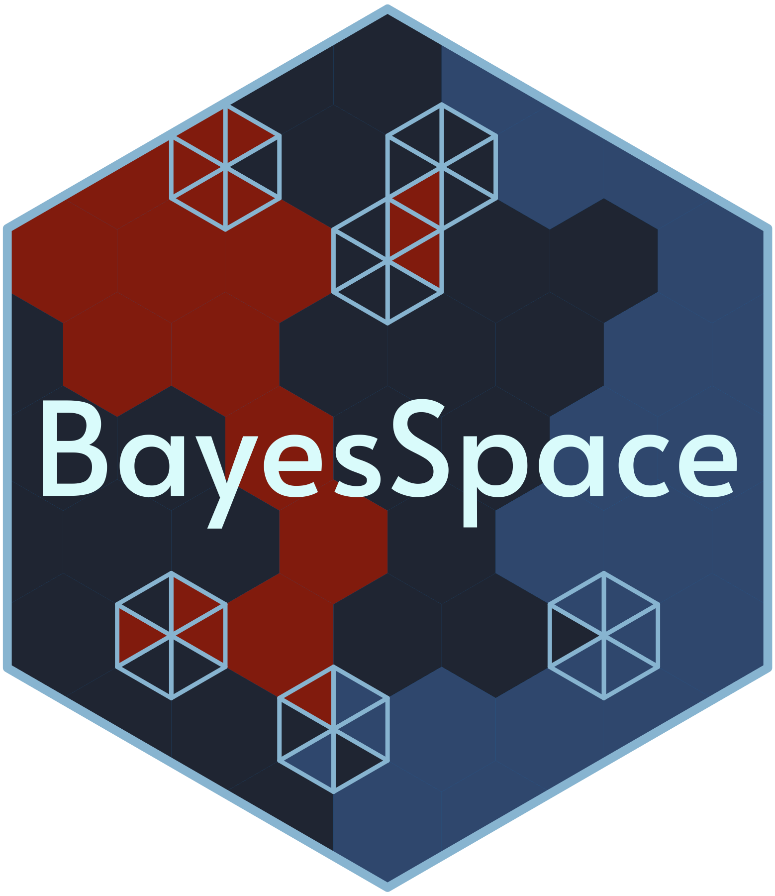

# BayesSpace 

  <!-- badges: start -->
  [](https://github.com/edward130603/BayesSpace/actions)
  <!-- badges: end -->

## Overview 

BayesSpace provides tools for clustering and enhancing the resolution of spatial
gene expression experiments.

BayesSpace clusters a low-dimensional representation of the gene expression
matrix, incorporating a spatial prior to encourage neighboring spots to cluster
together. The method can enhance the resolution of the low-dimensional
representation into "sub-spots", for which features such as gene expression or
cell type composition can be imputed.

## System requirements

### Operating system

BayesSpace has been built and tested on the following operating systems:

* Linux: Ubuntu 18.04.4 LTS (Bionic Beaver)
* macOS: 10.14.6 (Mojave), 10.15.6 (Catalina)
* Windows: 10, Server 2012 R2 Standard

### Software dependencies

BayesSpace requires R 4.0 and Bioconductor 3.11. Specific package dependencies
are defined in the package DESCRIPTION and are managed by the Bioconductor and
devtools installers.

## Installation

BayesSpace has been submitted to Bioconductor. Until its availability there, it
can be installed with `devtools`:

```
# Install devtools if necessary
if (!requireNamespace("devtools", quietly = TRUE))
    install.packages("devtools")

devtools::install_github("edward130603/BayesSpace")
```

Installation, including compilation, should take no more than one minute.

### Installing from source on macOS

Installing from source on macOS (such as when installing via
`devtools::install_github()`) requires
[Fortran](https://github.com/fxcoudert/gfortran-for-macOS) to compile the Rcpp
code.

Download links for the appropriate macOS versions can be found here:
* Mojave (10.14) and Catalina (10.15) - [gfortran8.2](https://github.com/fxcoudert/gfortran-for-macOS/releases/download/8.2/gfortran-8.2-Mojave.dmg)
* Sierra (10.12) and High Sierra (10.13) - [gfortran6.3](https://github.com/fxcoudert/gfortran-for-macOS/releases/download/6.3/gfortran-6.3-Sierra.dmg)

Additional details on installing the R compiler tools for Rcpp on macOS can be
found [in this blog
post](https://thecoatlessprofessor.com/programming/cpp/r-compiler-tools-for-rcpp-on-macos/).

Note about homebrew: While gfortran is available via homebrew, we've
encountered issues linking to its libraries after installation. We recommend
installing directly from the [GNU Fortran
repo](https://github.com/fxcoudert/gfortran-for-macOS).

## Demonstration

For an example of typical BayesSpace usage, please see our [package
vignette](https://edward130603.github.io/BayesSpace/articles/BayesSpace.html)
for a demonstration and overview of the functions included in BayesSpace.

Running the entire vignette takes approximately 5m30s on a Macbook Pro with a
2.0 GHz quad-core processor and 16 GB of RAM.
