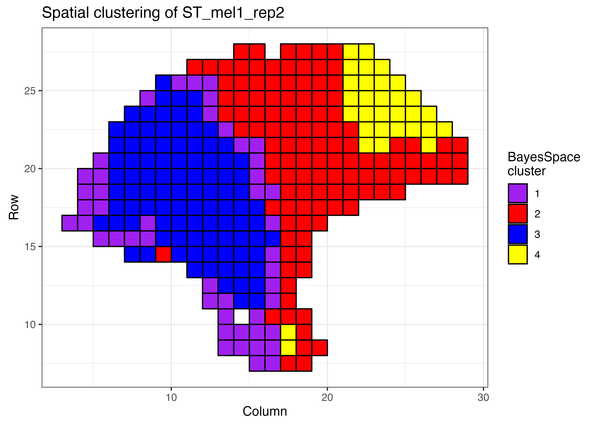
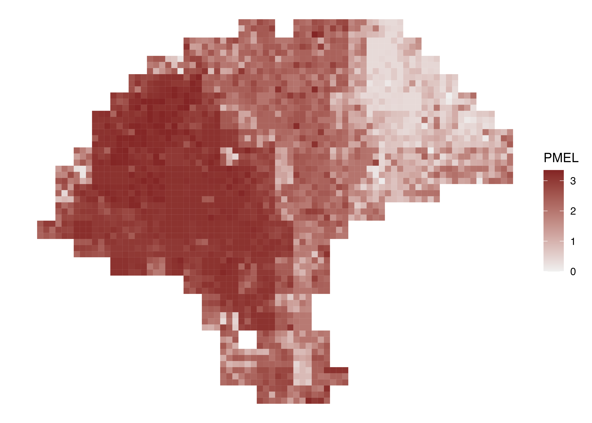
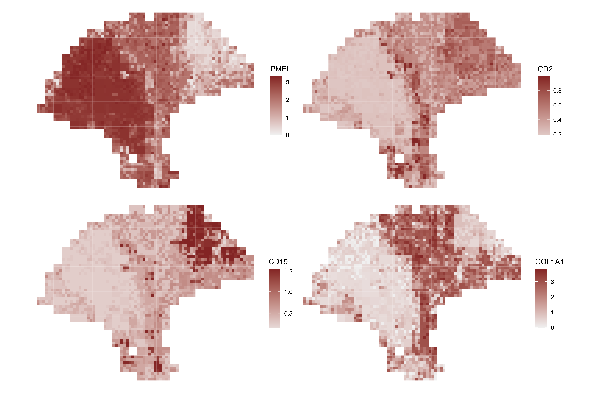
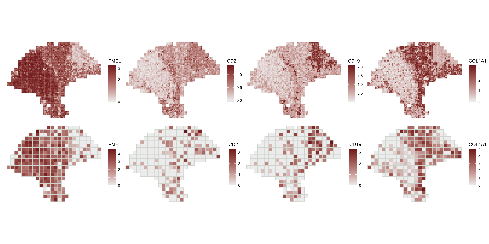

```r
library(SingleCellExperiment)
library(ggplot2)
library(BayesSpace)
```

## Preparing your experiment for BayesSpace

### Loading data

BayesSpace supports three ways of loading a `SingleCellExperiment` for analysis.

Visium datasets processed with [Space
Ranger](https://support.10xgenomics.com/spatial-gene-expression/software/pipelines/latest/what-is-space-ranger)
can be loaded directly via the `readVisium()` function. This function takes only
the path to the Space Ranger output directory (containing the `spatial/` and
`filtered_feature_bc_matrix/` subdirectories) and returns a
`SingleCellExperiment`.


```r
sce <- readVisium("path/to/spaceranger/outs/")
```

Second, all datasets analyzed for the BayesSpace manuscript are readily
accessible via the `getRDS()` function. This function takes two arguments - the
name of the dataset, and the name of the sample in the dataset.


```r
melanoma <- getRDS(dataset="2018_thrane_melanoma", sample="ST_mel1_rep2")
```

<!-- TODO: add this metadata to the RDS on S3 -->


Finally, `SingleCellExperiment` objects can be constructed manually from a
counts matrix and tables of row and column data. BayesSpace only requires that
spot array coordinates be provided as columns named `row` and `col` in
`colData`. (Note that enhancement of Visium datasets additionally requires the
pixel coordinates of each spot in the tissue image, but in this case the dataset
should be loaded with `readVisium()`.)
<!-- TODO: migrate over the make_RDS() function from spatial-datasets -->

```r
sce <- SingleCellExperiment(assays=list(counts=counts),
                            rowData=rowData,
                            colData=colData)
```

We'll continue with the melanoma sample from the 2018 Spatial Transcriptomics
paper for the remaining examples in this vignette.

### Pre-processing data

BayesSpace requires minimal data pre-processing, but we provide a helper
function to automate it.

`spatialPreprocess()` log-normalizes the count matrix and performs PCA on the
top `n.HVGs` highly variable genes, keeping the top `n.PCs` principal
components. Additionally, the spatial sequencing platform is added as metadata
in the `SingleCellExperiment` for downstream analyses. If you do not wish to
rerun PCA, running `spatialPreprocess()` with the flag `skip.PCA=TRUE` will only
add the metadata BayesSpace requires.

Here, we omit log-normalization as all datasets available through `getRDS()`
already include log-normalized counts.

```r
set.seed(102)
melanoma <- spatialPreprocess(melanoma, platform="ST", 
                              n.PCs=7, n.HVGs=2000, log.normalize=FALSE)
```

## Clustering

### Selecting the number of clusters

We can use the `qTune()` and `qPlot()` functions to help choose `q`, the number
of clusters to use in our analysis.  

* `qTune()` runs the BayesSpace clustering algorithm for multiple specified
values of `q` (by default, 3 through 7) and computes their average
pseudo-log-likelihood. It accepts any arguments to `spatialCluster()`.
* `qPlot()` plots the pseudo-log-likelihood as a function of `q`; we suggest
choosing a `q` around the elbow of this plot.


```r
melanoma <- qTune(melanoma, qs=seq(2, 10), platform="ST", d=7)
qPlot(melanoma)
```


### Clustering with BayesSpace

The `spatialCluster()` function clusters the spots, and adds the predicted
cluster labels to the `SingleCellExperiment`. Typically, as we did for the
analyses in the paper, we suggest running with at least 10,000 iterations
(`nrep=10000`), but we use 1,000 iteration in this demonstration for the sake of
runtime. (Note that a random seed must be set in order for the results to be
reproducible.)

<!-- TODO: parse platform from metadta -->

```r
set.seed(149)
melanoma <- spatialCluster(melanoma, q=4, platform="ST", d=7,
                           init.method="mclust", model="t", nrep=1000, 
                           save.chain=TRUE)
```

Both the mclust initialization (`cluster.init`) and the BayesSpace cluster
assignments (`spatial.cluster`) are now available in the SingleCellExperiment's
`colData`.

```r
head(colData(melanoma))
#> DataFrame with 6 rows and 5 columns
#>            row       col sizeFactor cluster.init spatial.cluster
#>      <integer> <integer>  <numeric>    <numeric>       <numeric>
#> 7x15         7        15   0.795588            1               1
#> 7x16         7        16   0.307304            1               1
#> 7x17         7        17   0.331247            2               2
#> 7x18         7        18   0.420747            3               2
#> 8x13         8        13   0.255453            1               1
#> 8x14         8        14   1.473439            1               1
```

### Visualizing spatial clusters

We can plot the cluster assignments over the spatial locations of the spots with
`clusterPlot()`.

```r
clusterPlot(melanoma)
```


As `clusterPlot()` returns a `ggplot` object, it can be customized by composing
with familiar `ggplot2` functions. Additionally, the argument `palette` sets the
colors used for each cluster, and `clusterPlot()` takes additional arguments to
`geom_polygon()` such as `size` or `color` to control the aesthetics of the spot
borders.

```r
clusterPlot(melanoma, palette=c("purple", "red", "blue", "yellow"), color="black") +
  theme_bw() +
  xlab("Column") +
  ylab("Row") +
  labs(fill="BayesSpace\ncluster", title="Spatial clustering of ST_mel1_rep2")
```




## Enhanced resolution

### Clustering at enhanced resolution

The `spatialEnhance()` function will enhance the resolution of the principal
components, and add these PCs as well as predicted cluster labels at subspot
resolution to a new `SingleCellExperiment`.

```r
melanoma.enhanced <- spatialEnhance(melanoma, q=4, platform="ST", d=7,
                                    model="t", nrep=10000, save.chain=TRUE)
```

The enhanced `SingleCellExperiment` includes an index to the parent spot in the
original `sce` (`spot.idx`), along with an index to the subspot. It adds the
offsets to the original spot coordinates, and provides the enhanced cluster
label (`spatial.cluster`).

```r
head(colData(melanoma.enhanced))
#> DataFrame with 6 rows and 9 columns
#>              spot.idx subspot.idx  spot.row  spot.col       row       col
#>             <numeric>   <integer> <integer> <integer> <numeric> <numeric>
#> subspot_1.1         1           1         7        15   7.33333   15.3333
#> subspot_2.1         2           1         7        16   7.33333   16.3333
#> subspot_3.1         3           1         7        17   7.33333   17.3333
#> subspot_4.1         4           1         7        18   7.33333   18.3333
#> subspot_5.1         5           1         8        13   8.33333   13.3333
#> subspot_6.1         6           1         8        14   8.33333   14.3333
#>              imagerow  imagecol spatial.cluster
#>             <numeric> <numeric>       <numeric>
#> subspot_1.1   7.33333   15.3333               1
#> subspot_2.1   7.33333   16.3333               1
#> subspot_3.1   7.33333   17.3333               2
#> subspot_4.1   7.33333   18.3333               3
#> subspot_5.1   8.33333   13.3333               1
#> subspot_6.1   8.33333   14.3333               1
```

We can plot the enhanced cluster assignments as above.

```r
clusterPlot(melanoma.enhanced)
```


### Enhancing the resolution of gene expression

BayesSpace operates on the principal components of the gene expression matrix,
and `spatialEnhance()` therefore computes enhanced resolution PC vectors.
Enhanced gene expression is not computed directly, and is instead imputed using
a regression algorithm. For each gene, a model using the PC vectors of each spot
is trained to predict the spot-level gene expression, and the fitted model is
used to predict subspot expression from the subspot PCs. 

Gene expression enhancement is implemented in the `enhanceFeatures()` function.
BayesSpace predicts expression with
[`xgboost`](https://xgboost.readthedocs.io/en/latest/) by default, but linear
and Dirichlet regression are also available via the `model` argument.

`enhanceFeatures()` can be used to impute subspot-level expression for all
genes, or for a subset of genes of interest. Here, we'll demonstrate by
enhancing the expression of four marker genes: PMEL (melanoma), CD2 (T-cells),
CD19 (B-cells), and COL1A1 (fibroblasts).

<!-- TODO: swap CD2 for CD7? -->

```r
markers <- c("PMEL", "CD2", "CD19", "COL1A1")
melanoma.enhanced <- enhanceFeatures(melanoma.enhanced, melanoma, feature_names=markers)
```

By default, log-normalized expression (`logcounts(sce)`) is imputed, although
other assays or arbitrary feature matrices can be specified.

```r
logcounts(melanoma.enhanced)[markers, 1:5]
#>        subspot_1.1 subspot_2.1 subspot_3.1 subspot_4.1 subspot_5.1
#> PMEL     2.4870646   2.7509048   2.8261802   3.0204065   2.3573151
#> CD2      0.2912743   0.2620982   0.1512688   0.1964293   0.2641788
#> CD19     0.7622972   0.1347447   0.2185815   0.6592661   0.5862058
#> COL1A1   1.0887744   1.0368935   0.5175448   0.2758219   1.6262674
```

Diagnostic measures from each predictive model, such as `rmse` when using
`xgboost`, are added to the `rowData` of the enhanced dataset.

```r
rowData(melanoma.enhanced)[markers, ]
#> DataFrame with 4 rows and 3 columns
#>                gene_id   gene_name enhanceFeatures.rmse
#>            <character> <character>            <numeric>
#> PMEL   ENSG00000185664        PMEL             0.810096
#> CD2    ENSG00000116824         CD2             0.574478
#> CD19   ENSG00000177455        CD19             0.629373
#> COL1A1 ENSG00000108821      COL1A1             0.810443
```


### Visualizing enhanced gene expression

Spatial gene expression is visualized with `featurePlot()`.

```r
featurePlot(melanoma.enhanced, "PMEL")
```



Here, we compare the spatial expression of the imputed marker genes.

```r
enhanced.plots <- purrr::map(markers, function(x) featurePlot(melanoma.enhanced, x))
patchwork::wrap_plots(enhanced.plots, ncol=2)
```



And we can compare to the spot-level expression.

```r
spot.plots <- purrr::map(markers, function(x) featurePlot(melanoma, x))
patchwork::wrap_plots(c(enhanced.plots, spot.plots), ncol=4)
```




## Accessing Markov chains

If `save.chain` is set to `TRUE` in either `spatialCluster()` or
`spatialEnhance()`, the chain associated with the respective MCMC run is
preserved to disk as an HDF5 file. The path to this file is stored in the
SingleCellExperiment's metadata at `metadata(sce)$h5.chain`, and can be read
directly using `mcmcChain()`.

The chain is provided as a `coda::mcmc` object, which can be analyzed with
[TidyBayes](https://mjskay.github.io/tidybayes/) or as a matrix. The object has
one row per iteration, with the values of the parameters concatenated across the
row. Columns are named with the parameter name and index (if any).

```r
chain <- mcmcChain(melanoma)
chain[1:5, 1:5]
#>      lambda[1,1]  lambda[1,2] lambda[1,3] lambda[1,4]   lambda[1,5]
#> [1,]  0.01000000  0.000000000  0.00000000  0.00000000  0.000000e+00
#> [2,]  0.09722481 -0.007032172 -0.04138590  0.06750923 -1.657124e-02
#> [3,]  0.10005081 -0.011770303 -0.05441956  0.05277598 -5.511917e-05
#> [4,]  0.13415146 -0.016241599 -0.06767107  0.02913552 -1.965898e-02
#> [5,]  0.12653856 -0.003725852 -0.05992947  0.03122306 -2.359439e-02
```

To remove the HDF5 file from disk and remove its path from the metadata, use
`removeChain()`.
