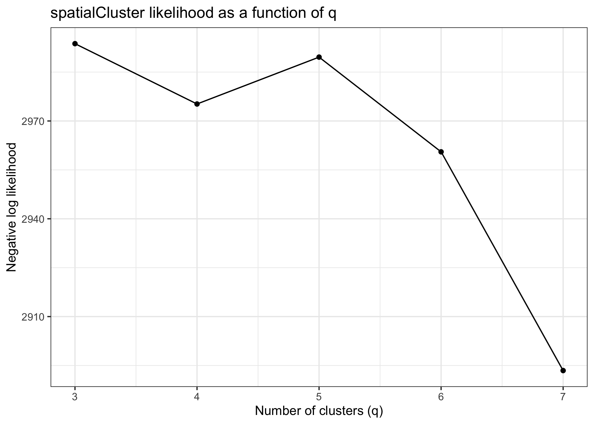
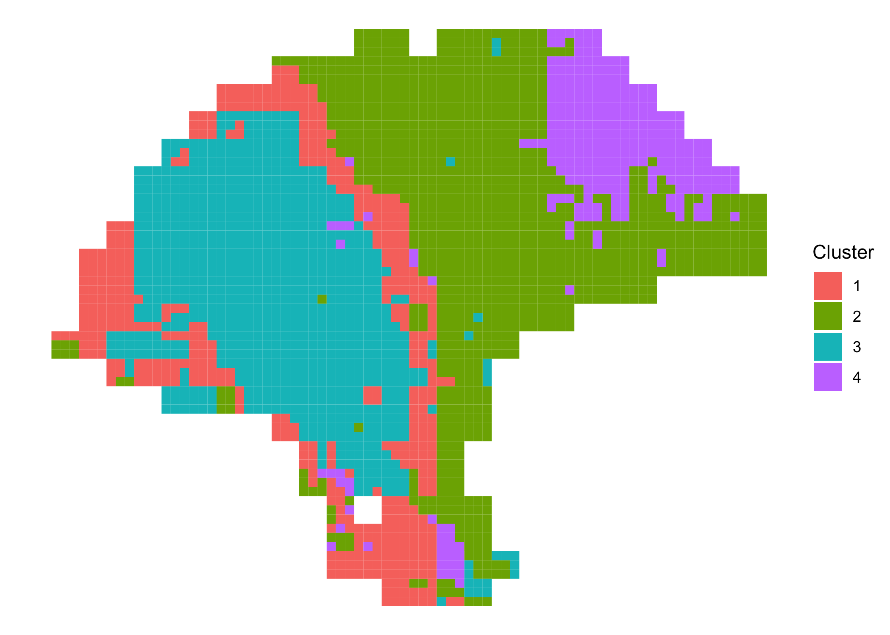

```r
suppressPackageStartupMessages({
  library(SingleCellExperiment)
  library(ggplot2)
  library(BayesSpace)
})
```

## Preprocessing

We'll obtain one of the melanoma samples from the 2018 Spatial Transcriptomics
paper for this example.

TODO: switch to a subset of a Visium dataset so we don't need to specify position.cols and radius in demo

```r
sce <- getRDS(dataset="2018_thrane_melanoma", sample="ST_mel1_rep2")
```

Our processed datasets already include PCs, but in general it's necessary to
preprocess samples by running PCA. We recommend running PCA on only the top
highly variable genes.

```r
set.seed(102)
dec <- scran::modelGeneVar(sce)
top <- scran::getTopHVGs(dec, n=2000)
sce <- scater::runPCA(sce, subset_row=top)
```

We can use the `qTune()` and `qPlot()` functions to help choose the number of
clusters to use in our analysis.

```r
sce <- qTune(sce, position.cols=c("col", "row"), radius=1)
qPlot(sce)
```



## Clustering
The `spatialCluster()` function will cluster the spots, and add the predicted
cluster labels to `colData(sce)`. Typically, and for analyses in the paper, we
suggest running with at least 10,000 iterations (`nrep=10000`), but we use 1,000
iteration in this demonstration for the sake of runtime.

TODO: clarify row/col vs imagerow/imagecol, and ST vs visium

```r
set.seed(149)
sce <- spatialCluster(sce, q=4, init.method="mclust", model="t", nrep=10000, 
                      position.cols=c("col", "row"), radius=1, save.chain=TRUE)
```

Both the mclust initialization (`cluster.init`) and the BayesSpace cluster assignments (`spatial.cluster`) are now available in the SingleCellExperiment's `colData`.

```r
head(colData(sce))
#> DataFrame with 6 rows and 5 columns
#>            row       col sizeFactor cluster.init spatial.cluster
#>      <integer> <integer>  <numeric>    <numeric>       <numeric>
#> 7x15         7        15   0.795588            1               1
#> 7x16         7        16   0.307304            1               1
#> 7x17         7        17   0.331247            2               2
#> 7x18         7        18   0.420747            3               2
#> 8x13         8        13   0.255453            1               1
#> 8x14         8        14   1.473439            1               1
```


We can plot the cluster assignments over the spatial locations of the spots.

```r
ggplot(as.data.frame(colData(sce)), aes(x = col, y = row, fill = factor(spatial.cluster))) +
  geom_point(size = 7, pch = 22) +
  labs(x = NULL, y = NULL, fill = "Cluster") +
  scale_fill_manual(values = c("purple", "red", "blue", "yellow")) +
  theme_void() + 
  coord_fixed()
```


## Enhanced resolution

The `spatialEnhance()` function will enhance the resolution of the principal
components, and add these PCs as well as predicted cluster labels at subspot
resolution to a new SingleCellExperiment.

```r
enhanced <- spatialEnhance(sce, q=4, init=sce$spatial.cluster, model="t", nrep=10000, 
                           position.cols=c("col", "row"), xdist=1, ydist=1, save.chain=TRUE)
```

The enhanced SingleCellExperiment includes an index to the parent spot in the original `sce` (`spot.idx`), along with an index to the subspot. It adds the offsets to the original spot coordinates, and provides the enhanced cluster label (`spatial.cluster`).

```r
head(colData(enhanced))
#> DataFrame with 6 rows and 7 columns
#>              spot.idx subspot.idx       row       col  imagerow  imagecol spatial.cluster
#>             <numeric>   <integer> <numeric> <numeric> <numeric> <numeric>       <numeric>
#> subspot_1.1         1           1   7.33333   15.3333   7.33333   15.3333               1
#> subspot_2.1         2           1   7.33333   16.3333   7.33333   16.3333               2
#> subspot_3.1         3           1   7.33333   17.3333   7.33333   17.3333               2
#> subspot_4.1         4           1   7.33333   18.3333   7.33333   18.3333               2
#> subspot_5.1         5           1   8.33333   13.3333   8.33333   13.3333               1
#> subspot_6.1         6           1   8.33333   14.3333   8.33333   14.3333               1
```


We can plot the enhanced cluster assignments as above.

```r
ggplot(as.data.frame(colData(enhanced)), aes(x = col, y = row, fill = factor(spatial.cluster))) +
  geom_point(size = 2.5, pch = 22) +
  labs(x = NULL, y = NULL, fill = "Cluster") +
  scale_fill_manual(values = c("purple", "red", "blue", "yellow")) +
  theme_void() + 
  coord_fixed()
```



Note that the enhanced PCs are stored as a `reducedDim` and the enhanced
SingleCellExperiment has no assays. To impute expression (or other features) at
subspot resolution, we need to run `enhanceFeatures()` afterwards.

By default, log-normalized expression (`logcounts(sce)`) is imputed, but other
assays or arbitrary features can be specified.

```r
enhanced <- enhanceFeatures(enhanced, sce) 
```

TODO: add outputs/plot for enhanceFeatures

## Accessing Markov chains

If `save.chain` is set to `TRUE` in either `spatialCluster()` or
`spatialEnhance()`, the chain associated with the respective MCMC run is
preserved to disk as an HDF5 file. The path to this file is stored in the
SingleCellExperiment's metadata at `metadata(sce)$h5.chain`, and can be read
directly using `mcmcChain()`.

The chain is provided as a `coda::mcmc` object, which can be analyzed with
[TidyBayes](https://mjskay.github.io/tidybayes/) or as a matrix. The object has
one row per iteration, with the values of the parameters concatenated across the
row. Columns are named with the parameter name and index (if any).

```r
chain <- mcmcChain(sce)
chain[1:5, 1:5]
#>      lambda[1,1] lambda[1,2] lambda[1,3] lambda[1,4]  lambda[1,5]
#> [1,]  0.01000000  0.00000000  0.00000000 0.000000000  0.000000000
#> [2,]  0.07716601  0.02809490  0.04923277 0.029632058  0.004986712
#> [3,]  0.07275226  0.04208836  0.03762690 0.008965030  0.002487695
#> [4,]  0.07805325  0.04867904  0.03494542 0.005154332 -0.017679223
#> [5,]  0.08875719  0.04706201  0.05793587 0.004569161 -0.059733913
```

To remove the HDF5 file from disk and remove its path from the metadata, use
`removeChain()`.
