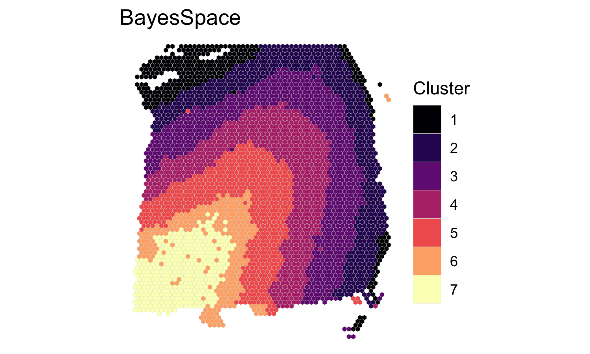
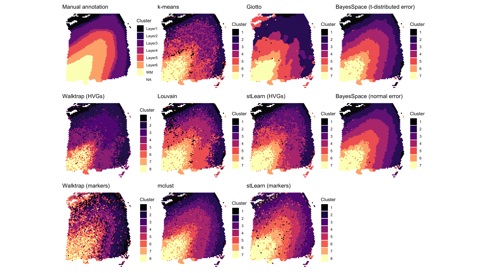
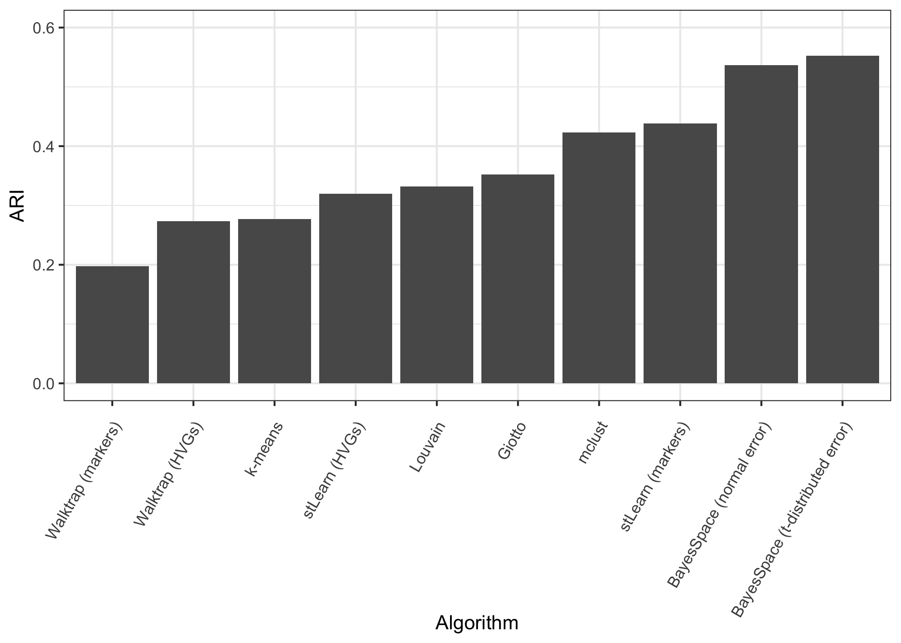

  


```r
library(BayesSpace)
library(ggplot2)
```

## Overview

Here we present our re-analysis of one of the dorsolateral prefrontal cortex
(DLPFC) samples originally reported by [Maynard et al.
(2020)](https://www.biorxiv.org/content/10.1101/2020.02.28.969931v1.full.pdf).
These data were obtained through the publicly accessible [spatialLIBD
package](http://www.bioconductor.org/packages/release/data/experiment/html/spatialLIBD.html)
on Bioconductor.

In the BayesSpace manuscript, we analyzed all twelve Visium samples provided by
Maynard et al. Here, we share the results for a single sample,
151673; we used the same code to analyze the other 11.

## Processing the data

A cleaned `SingleCellExperiment` object containing the dataset (after removing
data specific to the spatialLIBD analyses) is available through BayesSpace. We
preprocessed the data by performing PCA on the top 2,000 HVGs.


```r
dlpfc <- getRDS("2020_maynard_prefrontal-cortex", "151673")

set.seed(101)
dec <- scran::modelGeneVar(dlpfc)
top <- scran::getTopHVGs(dec, n = 2000)

set.seed(102)
dlpfc <- scater::runPCA(dlpfc, subset_row=top)

## Add BayesSpace metadata
dlpfc <- spatialPreprocess(dlpfc, platform="Visium", skip.PCA=TRUE)
```

## Clustering with BayesSpace

We clustered the first 15 principal components, specifying 7 clusters to match
the six brain layers plus one white matter region, and ran the MCMC algorithm
for 50,000 iterations. We set our smoothing parameter `gamma` to 3, which we
generally suggest for Visium datasets.


```r
q <- 7  # Number of clusters
d <- 15  # Number of PCs

## Run BayesSpace clustering
set.seed(104)
dlpfc <- spatialCluster(dlpfc, q=q, d=d, platform='Visium',
                        nrep=50000, gamma=3, save.chain=TRUE)

## We recoded the cluster labels to match the expected brain layers
labels <- dplyr::recode(dlpfc$spatial.cluster, 3, 4, 5, 6, 2, 7, 1)

## View results
clusterPlot(dlpfc, label=labels, palette=NULL, size=0.05) +
  scale_fill_viridis_d(option = "A", labels = 1:7) +
  labs(title="BayesSpace")
```



## Other clustering algorithms

### BayesSpace - normal error model

We ran several clustering algorithms on each sample to evaluate relative
performance. First, we ran the BayesSpace clustering algorithm using the normal
error model in order to demonstrate the t-distributed error model's improved
handling of outlier spots.


```r
clusters <- list()
clusters[["BayesSpace (t-distributed error)"]] <- dlpfc$spatial.cluster

set.seed(104)
dlpfc.normal <- spatialCluster(dlpfc, q=q, d=d, platform='Visium',
                               nrep=50000, gamma=3, model="normal")
clusters[["BayesSpace (normal error)"]] <- dlpfc.normal$spatial.cluster
```

### Non-spatial clustering algorithms

Next, we ran several popular non-spatial clustering algorithms that are
typically used in scRNA-seq analysis - k-means, Louvain, and mclust. For each of
these algorithms, we clustered the first 15 principal components of the
log-normalized expression matrix, specifying 7 clusters when possible. The
Louvain algorithm was run on the k=10 shared nearest neighbor graph (weighted
using Jaccard similarity). The mclust algorithm was run using the EEE
multivariate mixture model.


```r
Y <- reducedDim(dlpfc, "PCA")[, seq_len(d)]

## K-means
set.seed(103)
clusters[["k-means"]] <- kmeans(Y, centers = q)$cluster

## Louvain
set.seed(100)
g.jaccard = scran::buildSNNGraph(dlpfc, use.dimred="PCA", type="jaccard")
clusters[["Louvain"]] <- igraph::cluster_louvain(g.jaccard)$membership

## mclust (BayesSpace initialization)
set.seed(104)
library(mclust)
clusters[["mclust"]] <- Mclust(Y, G = 7, modelNames = "EEE")$classification
```

### Spatial clustering algorithms

We also ran two recently published spatial clustering algorithms, stLearn and
Giotto (HMRF). To analyze these samples we adapted the respective tutorials
([stLearn](https://stlearn.readthedocs.io/en/latest/stSME_clustering.html),
[Giotto](http://spatialgiotto.rc.fas.harvard.edu/giotto.visium.brain.html)) and
provide this code separately. For ease of reproduction, we include the obtained
cluster labels directly with this package.


```r
clusters[["stLearn (HVGs)"]] <- read.csv(system.file("extdata", "2020_maynard_prefrontal-cortex", "151673.stLearn_HVGs.csv", package = "BayesSpace"))$pca_kmeans + 1
clusters[["stLearn (markers)"]] <- read.csv(system.file("extdata", "2020_maynard_prefrontal-cortex", "151673.stLearn_markers.csv", package = "BayesSpace"))$pca_kmeans + 1
clusters[["Giotto"]] <- read.csv(system.file("extdata", "2020_maynard_prefrontal-cortex", "151673.Giotto_HMRF.csv", package = "BayesSpace"))$HMRF_km_Delaunay_k7_b.9
```

### spatialLIBD cluster assignments

Finally, to evaluate each algorithm's cluster assignments, we use the manual
annotations provided with the original data by Maynard et al. We
also compare the cluster assignments reported in this paper using the Walktrap
clustering algorithm (a non-spatial hierarchical clustering algorithm.)


```r
## Fetch original SCE with cluster labels
sce <- spatialLIBD::fetch_data(type="sce")
#> Loading objects:
#>   sce
sce <- sce[, sce$sample_name == "151673"]

## Walktrap and ground truth (manual annotations)
clusters[["Walktrap (HVGs)"]] <- sce$HVG_PCA_spatial
clusters[["Walktrap (markers)"]] <- sce$markers_PCA_spatial
clusters[["Manual annotation"]] <- sce$layer_guess_reordered
```

## Summary of clustering assignments

Here, we visualize the clustering of sample 151673 obtained using each
algorithm. In the left column we show the ground truth (manual annotations) and
the Walktrap clustering reported in the original study; in the second, we show
the non-spatial algorithms; in the third, the spatial algorithms we compared to;
and in the final column, we show the clustering identified by BayesSpace using
the t-distributed and normal error models. Note that the t-distributed model
resolves several of the outlier spots present when using the normal model.




Finally, we used the adjusted Rand index to evaluate the performance of each
algorithm with respect to the ground truth labels. In the manuscript we present
the range of ARIs obtained over all twelve samples.


```r
ARI <- purrr::map(clusters, function(x) mclust::adjustedRandIndex(x, clusters[["Manual annotation"]]))
```


## Spot weights and principal components

In Supplementary Figure S1, we also show the spatial distribution of the weights
$w_i$, along with the spatial distribution of the first three principal
components. We note that some of the visible outlier spots in the second and
third principal components are downweighted by the BayesSpace clustering
algorithm (low $w_i$).


```r
## Load the cached MCMC chain
chain <- mcmcChain(dlpfc)

## Average spot weights after excluding 1,000 burn-in iterations
burn.in <- 100
weights <- chain[, grep("weights", colnames(chain))]
weights <- apply(weights[-(1:burn.in),], 2, mean)

## Plot the weights
weights.plot <- featurePlot(dlpfc, weights, color=NA) +
  labs(fill=NULL, title=expression(Weights~(w[i]))) +
  scale_fill_gradient2(midpoint=1, low=scales::muted("blue"), high=scales::muted("red"), 
                       breaks=c(0, 0.5, 1, 1.5, 2), limits=c(0, 2))

## Plot the principal components
plot_PC <- function(comp) {
  featurePlot(dlpfc, reducedDim(dlpfc, "PCA")[, comp], color=NA) +
    viridis::scale_fill_viridis(option="A") +
    labs(fill=NULL, title=sprintf("PC%d", comp))
}
components <- c(1, 2, 3)
PC_plots <- purrr::map(components, plot_PC)

patchwork::wrap_plots(c(list(weights.plot), PC_plots))
```


