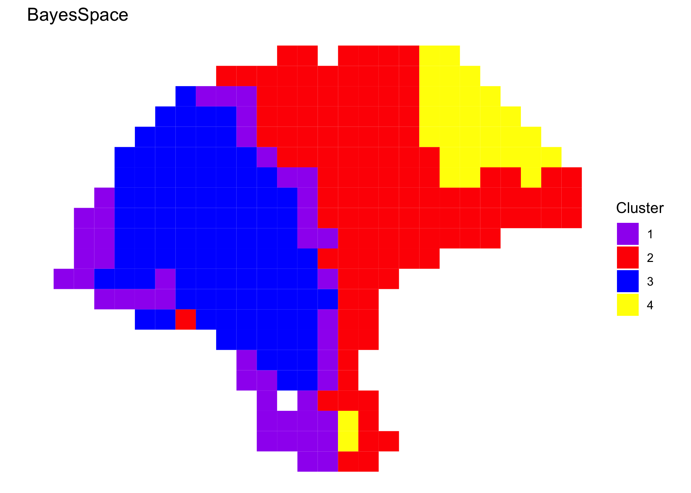

```r
library(SingleCellExperiment)
library(BayesSpace)
library(ggplot2)
library(patchwork)
```

Overview
--------

TODO: add citation, description

Processing the data
-------------------

A cleaned `SingleCellExperiment` object containing the dataset is available
through BayesSpace.

```r
melanoma1.2 <- getRDS("2018_thrane_melanoma", "ST_mel1_rep2")
```

We preprocess the data by performing PCA on the top 2,000 HVGs.

```r
set.seed(100)
dec <- scran::modelGeneVar(melanoma1.2)
top <- scran::getTopHVGs(dec, n = 2000)

set.seed(101)
melanoma1.2 <- scater::runPCA(melanoma1.2, subset_row = top)
```

Clustering with BayesSpace
--------------------------

We cluster the first seven principal components, specifying 4 clusters.


```r
q <- 4  # Number of clusters
d <- 7  # Number of PCs

## Run BayesSpace clustering
set.seed(100)
melanoma1.2 <- spatialCluster(melanoma1.2, q=q, d=d, platform="ST", gamma=2, nrep=1000)

## View results
palette <- c("purple", "red", "blue", "yellow", "darkblue")
clusterPlot(melanoma1.2, platform="ST", palette=palette) +
    labs(title="BayesSpace")
```




Comparison to other clustering algorithms
-----------------------------------------

We cluster the first seven principal components, specifying 4 clusters when 
necessary.

```r
Y1.2 <- reducedDim(melanoma1.2, "PCA")[, seq_len(d)]

## mclust (BayesSpace initialization)
library(mclust)
set.seed(100)
mclust.labels <- Mclust(Y1.2, q, "EEE")$classification
#> fitting ...
#> 
  |                                                                 
  |                                                           |   0%
  |                                                                 
  |==============================                             |  50%
  |                                                                 
  |===========================================================| 100%

## K-means
set.seed(103)
km.labels <- kmeans(Y1.2, centers = q)$cluster

## Louvain
set.seed(100)
g.jaccard <- scran::buildSNNGraph(melanoma1.2, use.dimred="PCA", type="jaccard", k = 25)
louvain.labels <- igraph::cluster_louvain(g.jaccard)$membership

## Giotto (pre-computed)
giotto.fname <- system.file("extdata", "thrane_HMRF_domains.csv", package = "BayesSpace")
giotto.labels <- read.csv(giotto.fname)$HMRF_PCA_k4_b.2
```


