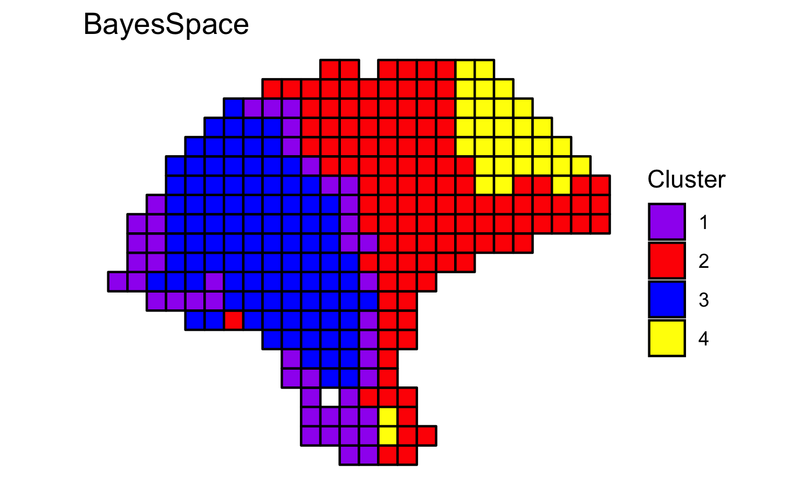
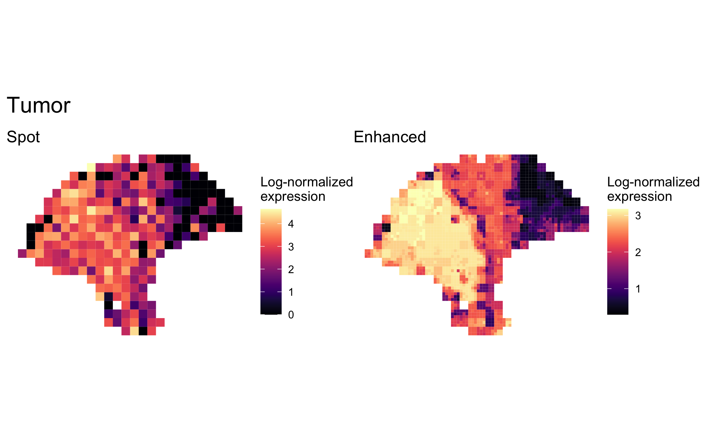
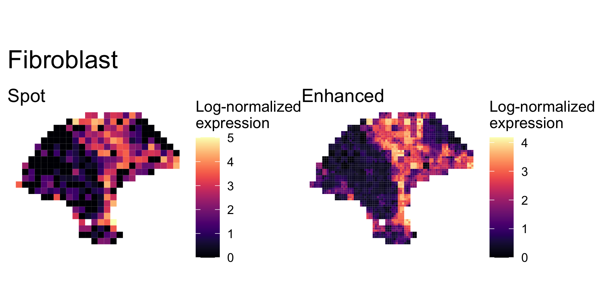
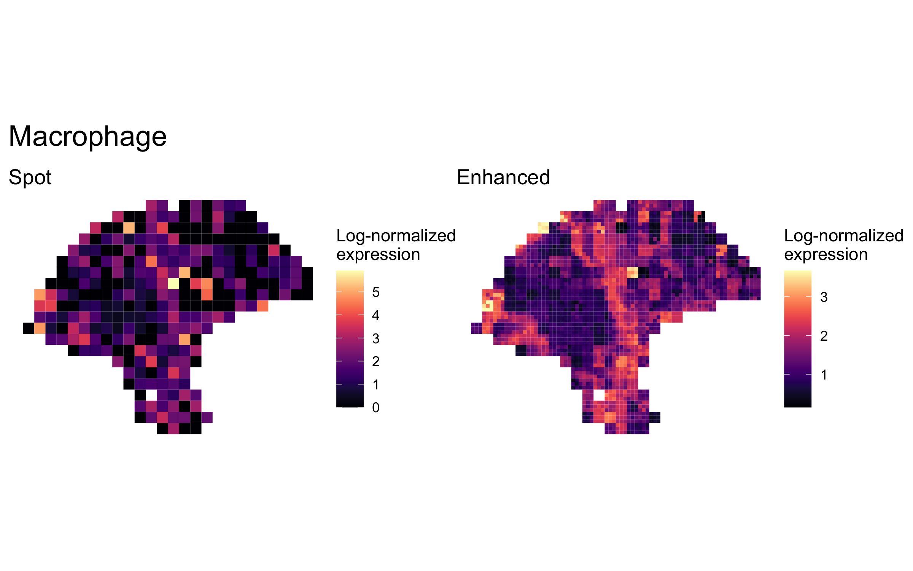
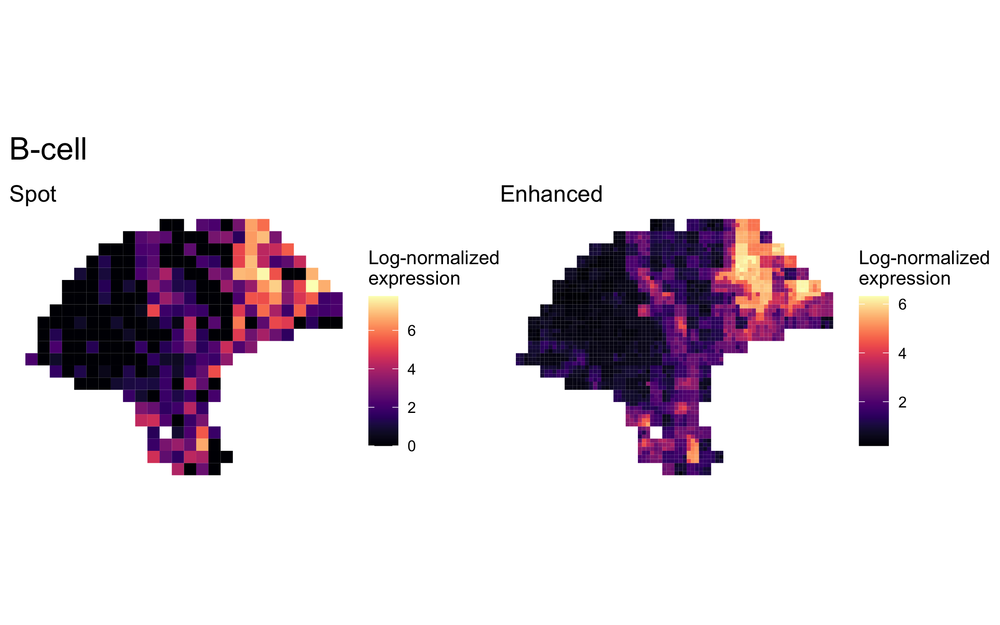
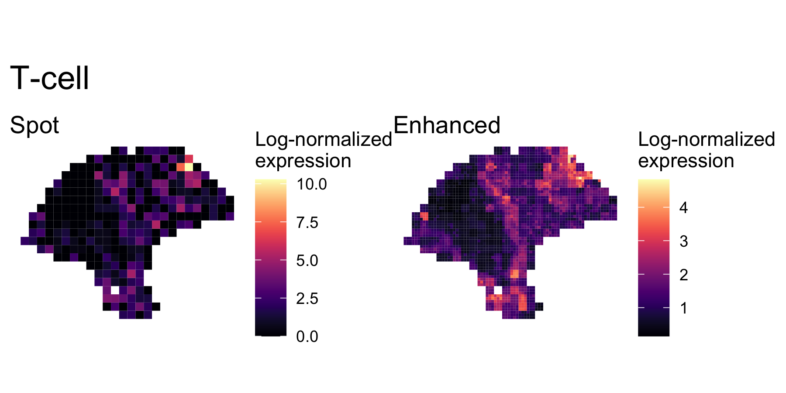
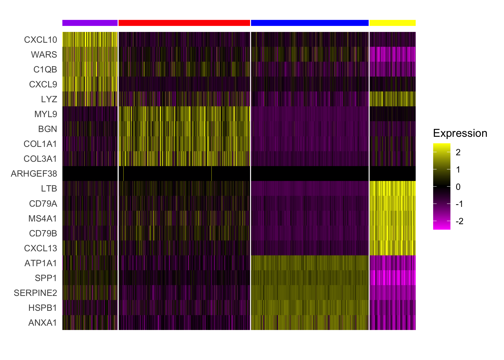
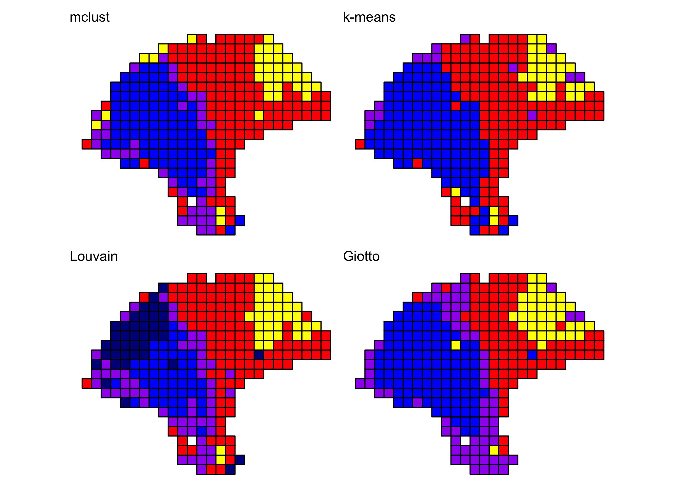

```r
library(BayesSpace)
library(ggplot2)
library(patchwork)
```

## Overview

TODO: add citation, description

## Processing the data

A cleaned `SingleCellExperiment` object containing the dataset is available
through BayesSpace. We preprocessed the data by performing PCA on the top 2,000 
HVGs.


```r
melanoma <- getRDS("2018_thrane_melanoma", "ST_mel1_rep2")

set.seed(100)
dec <- scran::modelGeneVar(melanoma)
top <- scran::getTopHVGs(dec, n = 2000)

set.seed(101)
melanoma <- scater::runPCA(melanoma, subset_row = top)

## Add BayesSpace metadata
melanoma <- spatialPreprocess(melanoma, platform="ST", skip.PCA=TRUE)

q <- 4  # Number of clusters
d <- 7  # Number of PCs
```


## Clustering with BayesSpace

We clustered the first seven principal components, specifying 4 clusters, and
ran the MCMC algorithm for 50,000 iterations. We generally suggest setting the
smoothing parameter gamma to 2 for ST experiments and to 3 for Visium data.


```r
## Run BayesSpace clustering
set.seed(100)
melanoma <- spatialCluster(melanoma, q=q, d=d, platform='ST',
                           nrep=50000, gamma=2)
```


```r
## View results
palette <- c("purple", "red", "blue", "yellow", "darkblue")
clusterPlot(melanoma, palette=palette, color="black") +
    labs(title="BayesSpace")
```



## Enhancing resolution with BayesSpace


```r
set.seed(100)
melanoma.enhanced <- spatialEnhance(melanoma, q=q, d=d, platform="ST",
                                    nrep=200000, gamma=2, 
                                    verbose=TRUE, save.chain=TRUE,
                                    jitter_scale=3.5, jitter_prior=0.3)
```


```r
clusterPlot(melanoma.enhanced, palette=palette, color="black", size=0.1) +
  labs(title="Enhanced clustering")
```


## Enhancement of marker gene expression


```r
markers <- list()
markers[["Tumor"]] <- c("PMEL")
markers[["Fibroblast"]] <- c("COL1A1")
markers[["Macrophage"]] <- c("CD14", "FCGR1A", "FCGR1B")
markers[["B-cell"]] <- c("CD19", "MS4A1")
markers[["T-cell"]] <- c("CD2", "CD3D", "CD3E", "CD3G", "CD7")
```


```r
melanoma.enhanced <- enhanceFeatures(melanoma.enhanced, melanoma,
                                     model="xgboost",
                                     feature_names=purrr::reduce(markers, c),
                                     nrounds=0)
```

We aggregated the expression of marker genes within each cell type by summing
their log-normalized expression.


```r
sum_counts <- function(sce, features) {
  if (length(features) > 1) {
    colSums(logcounts(sce)[features, ])
  } else {
    logcounts(sce)[features, ]
  }
}

spot_expr <- purrr::map(markers, function(xs) sum_counts(melanoma, xs))
enhanced_expr <- purrr::map(markers, function(xs) sum_counts(melanoma.enhanced, xs))
```

And we plotted the spatial expression of each cell type's markers at spot-level and at enhanced subspot resolution using
`featurePlot()`:


```r
plot_expression <- function(sce, expr, title) {
  featurePlot(sce, expr, color=NA) +
    viridis::scale_fill_viridis(option="A") +
    labs(title=title, fill="Log-normalized\nexpression")
}

plot_expression_comparison <- function(cell_type) {
  spot.plot <- plot_expression(melanoma, 
                               spot_expr[[cell_type]], 
                               "Spot")
  enhanced.plot <- plot_expression(melanoma.enhanced,
                                   enhanced_expr[[cell_type]], 
                                   "Enhanced")
  
  (spot.plot + enhanced.plot) + 
    plot_annotation(title=cell_type,
                    theme=theme(plot.title=element_text(size=18)))
}
```


```r
plot_expression_comparison("Tumor")
```



```r
plot_expression_comparison("Fibroblast")
```




```r
plot_expression_comparison("Macrophage")
```




```r
plot_expression_comparison("B-cell")
```




```r
plot_expression_comparison("T-cell")
```




## Differential expression analysis

We additionally performed a differential expression analysis between clusters of
interest. We limited our analysis to the top 2,000 highly variable genes, and we
first imputed the expression of these HVGs at enhanced resolution.


```r
## Using the same 2,000 HVGs previously computed for PCA
melanoma.enhanced <- enhanceFeatures(melanoma.enhanced, melanoma, 
                                     model="xgboost",
                                     feature_names=top,
                                     nrounds=0)
```


Next, we applied a standard Seurat differential expression analysis workflow to
the enhanced resolution.


```r
library(dplyr)

## Convert SCE to Seurat object and use BayesSpace cluster as identifier
sobj <- Seurat::CreateSeuratObject(counts=logcounts(melanoma.enhanced),
                                   assay='Spatial',
                                   meta.data=as.data.frame(colData(melanoma.enhanced)))
sobj <- Seurat::SetIdent(sobj, value = "spatial.cluster")

## Scale data
sobj@assays$Spatial@scale.data <-
  sobj@assays$Spatial@data %>% as.matrix %>% t %>% scale %>% t

## Select top n markers from each cluster (by log fold change)
top_markers <- Seurat::FindAllMarkers(sobj, assay='Spatial', slot='data',
                                      group.by='spatial.cluster',
                                      only.pos=TRUE) %>% 
  group_by(cluster) %>% 
  top_n(5, avg_logFC)

## Plot expression of markers
Seurat::DoHeatmap(sobj, features = top_markers$gene, slot='scale.data',
                  group.by = "spatial.cluster", group.colors=palette, 
                  angle=0, size=4, label = FALSE, raster=FALSE) + 
  guides(col = FALSE)
```




## Comparison to other clustering algorithms

We cluster the first seven principal components, specifying 4 clusters when 
necessary.

```r
Y1.2 <- reducedDim(melanoma, "PCA")[, seq_len(d)]

## mclust (BayesSpace initialization)
library(mclust)
set.seed(100)
mclust.labels <- Mclust(Y1.2, q, "EEE")$classification

## K-means
set.seed(103)
km.labels <- kmeans(Y1.2, centers = q)$cluster

## Louvain
set.seed(100)
g.jaccard <- scran::buildSNNGraph(melanoma, use.dimred="PCA", type="jaccard")
louvain.labels <- igraph::cluster_louvain(g.jaccard)$membership

## Giotto (pre-computed)
giotto.fname <- system.file("extdata", "thrane_HMRF_domains.csv", package = "BayesSpace")
giotto.labels <- read.csv(giotto.fname)$HMRF_PCA_k4_b.2
```


